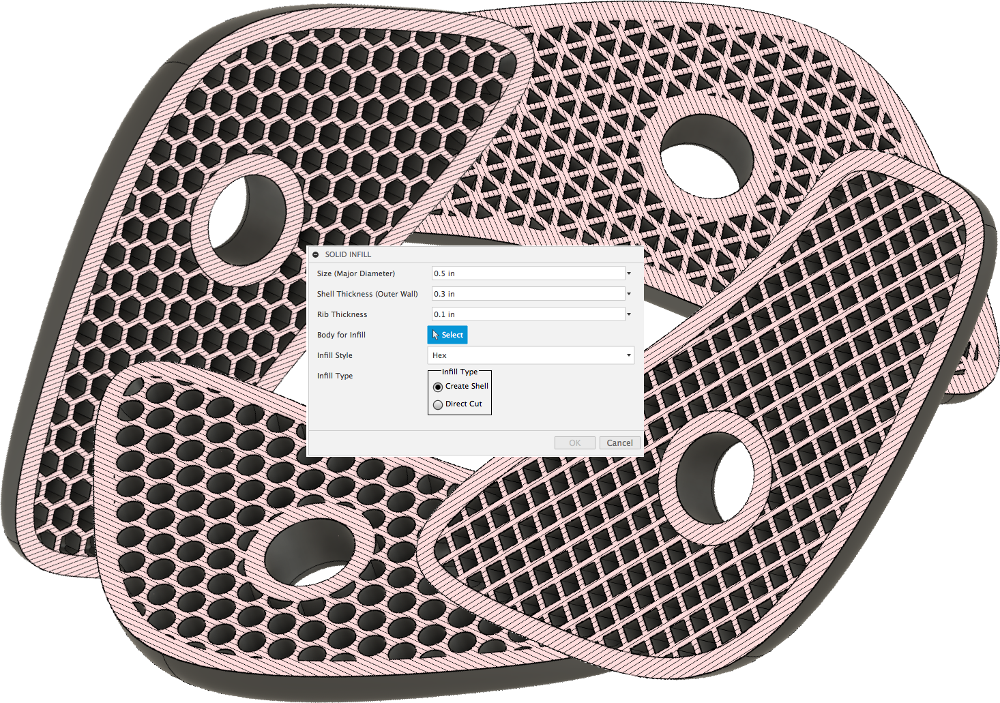
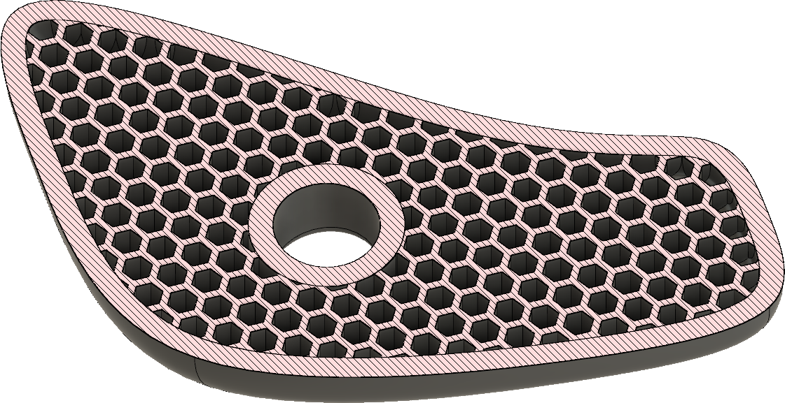
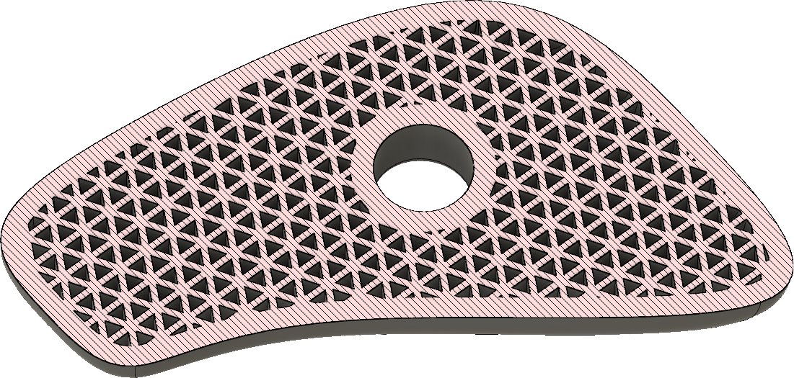
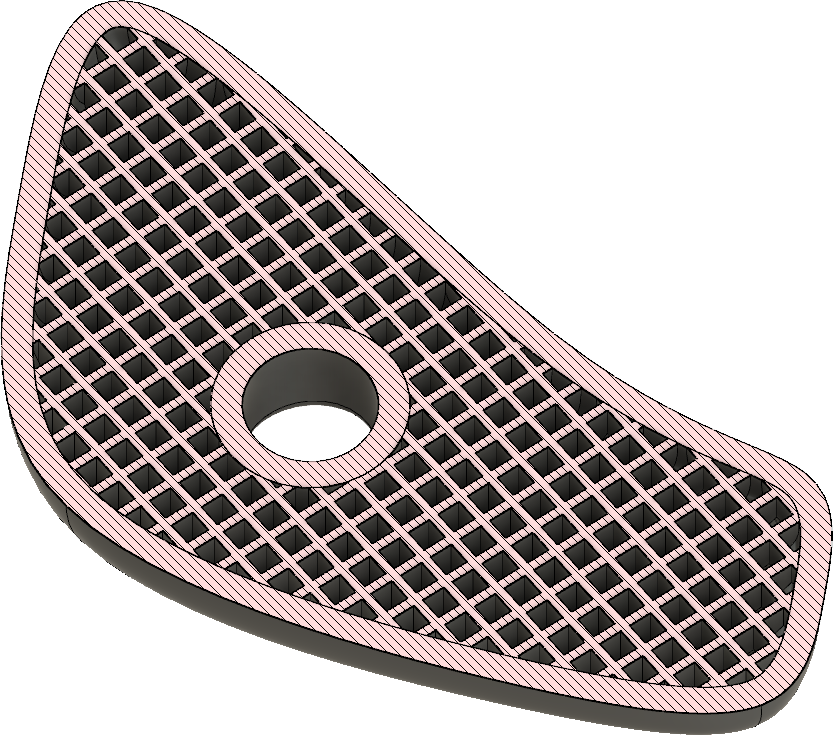
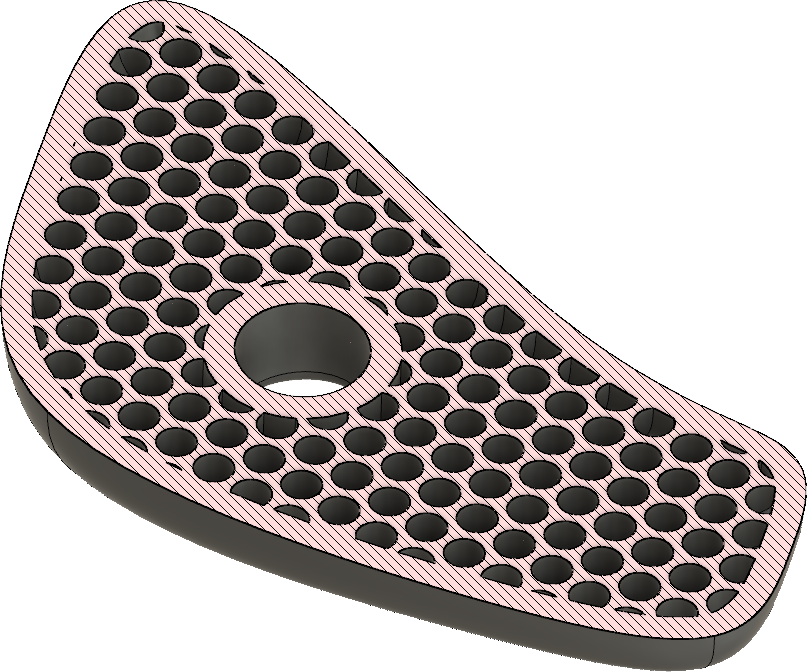

# Fusion 360 Filler
Create an infill pattern in a solid body

# Installation
[Click here to download the Add-in](https://github.com/tapnair/ventMaker/archive/master.zip)

After downloading the zip file follow the [installation instructions here](https://tapnair.github.io/installation.html) for your particular OS version of Fusion 360

# Usage

Documentation to come later. For now:
 - Select a Body in which to create infill
 - You can select a body and create an outer shell thickness plus infill.  This is most common.
 - Alternatively (for more complex geometry) you can manually create the "interior" body and then simply generate the infill pattern in this body.
 - Specify an outer wall (shell) thickness
 - Specify the rib thickness
 - Specify the "cell" size.  This is defined as the circumscribed circle diameter for a given cell.  Better documentation to come later.
 - Select the type of infill:
   - Hex

   
   - Triangles

   
   - Squares

   

   - Circles

   

## License
Samples are licensed under the terms of the [MIT License](http://opensource.org/licenses/MIT). Please see the [LICENSE](LICENSE) file for full details.

## Written by

Written by [Patrick Rainsberry](https://twitter.com/prrainsberry)   (Autodesk Fusion 360 Business Development)

See more useful [Fusion 360 Utilities](https://tapnair.github.io/index.html)

